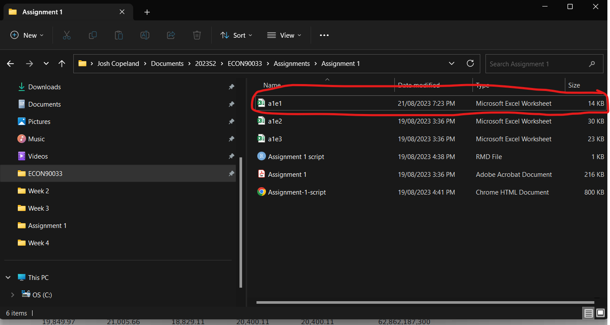
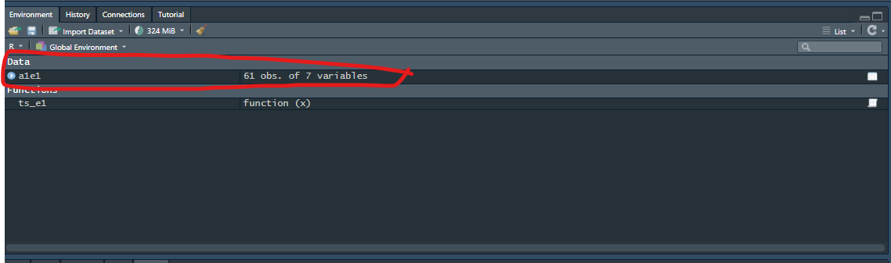
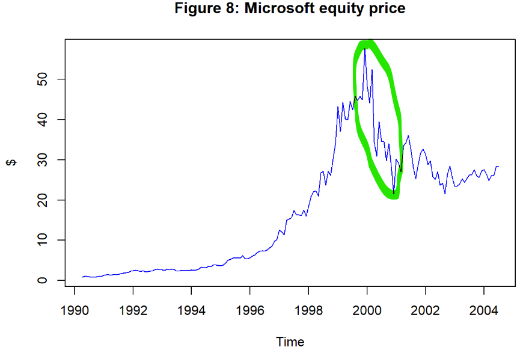

```{r packages, include=FALSE}

library(tidyverse)
library(knitr)
library(readxl)
library(janitor)
library(tseries)
library(car)

options(scipen=999) #Get's rid of scientific notation

```


# Exercise 1

```{r e1, echo=TRUE, out.width = '80%'}

ts_e1 <- function(x) {
  ts(x, start = c(2018,7), end = c(2023,7), frequency = 12)
}

a1e1 <- read_excel("a1e1.xlsx")

```

## a) Go to the Yahoo Finance website and search for Hang Seng Index (^HSI). Choose Historical data, Frequency: Monthly, Show: Historical prices, Time period: 1 July 2018 - 1 July 2023.


```{r e1a, echo=FALSE,out.width = '80%'}

```

## b) Take a picture of your RStudio window and insert the picture in your document. Create a ts object of the Adj Close series3, name it HSI and illustrate it with a nicely customised (title, label, colour) time-series plot. What does this plot tell you about the historical data pattern of the adjusted closing price of the Hang Seng Index during the last five years?

<br>

_Figure 1_ shows that the adjusted close index level of the Hang Seng Index fluctuates significantly over time and looks to resemble a random walk series. Neither its mean not variance seem constant over time.

The index level declined somewhat from the onset of the COVID-19 pandemic, before rallying to a local high in mid-2021. From there, it declined persistently until late 2022 and has recovered somewhat since then relative to previous highs. There is no clear constant negative or positive trend in its growth over time.

<br>

```{r e1bii, echo=FALSE, out.width = '80%'}



```

```{r e1biii, echo=TRUE, out.width = '80%'}

a1e1b <- a1e1 %>% 
  clean_names() %>% 
  select(adj_close) %>% 
  map(~ts(.x)) %>% 
  map(ts_e1) 


ts.plot(a1e1b[[1]], main = "Figure 1: Hang Seng Index adjusted close level", ylab = "Index", col = "blue")


```


## c) Compute the monthly simple returns and logarithmic returns of the Hang Seng Index and plot them. Comment on the plots.

<br>

_Figure 2_ and _Figure 3_ show the monthly simple and log returns for the Hang Seng Index between July 2018 and July 2023. Both series are very similar, which must mean return values are sufficiently small for the log approximation to hold relatively well.

<br>

Both series looks like they could be white noise processes, as they both seem to fluctuate around zero and their variance seems relatively constant over time. However, the large spike in returns during late 2022 is a notable outlier. Regardless of this spike in late 2022 or not, more analysis would be required to conclude if these series are a white noise processes.

<br>

```{r e1c, echo=TRUE, out.width = '80%'}


a1e1c <- a1e1 %>% 
  clean_names() %>% 
  select(adj_close) %>%
  mutate(adj_close_r = ((adj_close / lag(adj_close)) - 1)*100) %>% 
  mutate(adj_close_r_log = (log(adj_close) -lag(log(adj_close)))*100) %>% 
  map(~ts_e1(.x))

ts.plot(a1e1c[["adj_close_r"]], main = "Figure 2: Hang Seng Index monthly simple returns", ylab = "%", col = "blue")
abline(h=0)

ts.plot(a1e1c[["adj_close_r_log"]], main = "Figure 3: Hang Seng Index monthly log returns", ylab = "%", col = "red")
abline(h=0)


```


## d) Express the monthly simple and logarithmic returns in annualised form and plot the resultant series. Comment on the plots.

<br>

_Figure 4_ and _Figure 5_ show annualised monthly simple and log returns respectively for the Hang Seng Index. Because the absolute values of returns are much greater in annualised terms, log returns are not an accurate approximation of simple returns for all periods in the series. Log returns only effectively approximate simple returns for small values of x.

This is most clearly the case for the large spike in returns recorded in late 2022. Although both graphs record large spikes, the spike in simple returns is significantly higher at around 1600-1700% over this period compared to around 1100-1200% for the annualised log return.

However, besides this large spike in returns at the end of 2022, log returns seem to approximate simple returns reasonably well. Furthermore, excluding this big spike in returns at the end of 2022, the series seems to have a fairly constant mean and variance.

<br>

```{r e1d, echo=TRUE, out.width = '80%'}


a1e1d <- a1e1 %>% 
  clean_names() %>% 
  select(adj_close) %>%
  mutate(adj_close_r = (adj_close / lag(adj_close)) - 1) %>% 
  #Note: The average calendar month contains 30.437 days
  mutate(adj_close_r_annualised = ((1+adj_close_r)^(365/30.437) - 1)*100) %>% 
  mutate(adj_close_r_log = log(adj_close) -lag(log(adj_close))) %>% 
  mutate(adj_close_r_log_annualised = ((1+adj_close_r_log)^(365/30.437) - 1)*100) %>% 
  map(~ts(.x)) %>% 
  map(ts_e1) 

ts.plot(a1e1d[["adj_close_r_annualised"]], main = "Figure 4: Hang Seng Index monthly simple returns (annualised)", ylab = "%", col = "blue", ylim = c(-200, 2000)) 
abline(h=0)

ts.plot(a1e1d[["adj_close_r_log_annualised"]], main = "Figure 5: Hang Seng Index monthly log returns (annualised)", ylab = "%", col = "red", ylim = c(-200, 2000))
abline(h=0)

```


## e) Compute the returns to holding HSI over the entire sample period (i.e., the holding period return) in both simple and logarithmic forms. Comment on the results.

<br>

_HPR_simple_per_cent_ and _HPR_log_per_cent_ calculate the simple and log holding period return respectively for the Hang Seng Index over the entire period of our sample.

There is a large difference between these two calculations, around 7 percentage points. Again, this difference reflects the fact that log returns do not effectively approximate returns for large values of x. This exercise shows that an x value around 30 is too large for logs to effectively approximate growth.

This could imply that Figure 4 and Figure 5 are perhaps not as similar from eyeballing those graphs as initially thought. More rigorous analysis should be undertaken to confirm if they are as similar as they seem at face value from the graphs given.

<br>

```{r e1e, echo=TRUE, out.width = '80%'}

a1e1e <- a1e1 %>% 
  clean_names() %>% 
  select(date,adj_close) 

a1e1e_first <- a1e1e %>% 
  filter(date == max(date)) %>% 
  pull(adj_close)

a1e1e_final <- a1e1e %>% 
  filter(date == min(date)) %>% 
  pull(adj_close)
  
#Note: HPR = Holding period return

HPR_simple_per_cent <- (a1e1e_final / a1e1e_first - 1) * 100
HPR_log_per_cent <- (log(a1e1e_final) - log(a1e1e_first)) * 100

print(HPR_simple_per_cent)
print(HPR_log_per_cent)

```


# Exercise 2

<br>

```{r e2, echo=TRUE, out.width = '80%'}

ts_e2 <- function(x) {
  ts(x, start = c(1946,12), end = c(1987,2), frequency = 12)
}

a1e2 <- read_excel("a1e2.xlsx")

```

## a) Plot the 2, 3, 4, 5, 6 and 9 months United States zero coupon yields on a single nicely customised (title, label, colour) time-series plot. Comment on the line chart.

<br>

_Figure 6_ below shows the monthly yield for zero coupon US bonds for maturities of 2 to 6 months, as well as 9 months from December 1946 to February 1987. By looking at the chart, we can see that the returns of all the yields plotted moved together in very similar patterns regardless of their maturity. However, by referring to the legend we know that the lowest and highest maturity (2 and 9 month) bonds act as a lower and upper bounds for yields seen, as can be seen by the gap between the black and purple lines.

This series is likely non-stationary as its mean and variance change over time, and could likely also be defined as a random walk. It also looks like these series have a high degree of first order positive autocorrelation. Given the large movements in 1980 these series may also be heteroskedastic, but this is the least certain of these observations.

<br>

```{r e2a, echo=TRUE, out.width = '80%'}

a1e2a <- a1e2 %>% 
  select(-dates) %>% 
  map(~ts_e2(.x))

ts.plot(a1e2a[["r2"]], main = "Figure 6: United States zero coupon monthly yields", ylab = "%", col = 1)
lines(a1e2a[["r3"]], col = 2)
lines(a1e2a[["r4"]], col = 3)
lines(a1e2a[["r5"]], col = 4)
lines(a1e2a[["r6"]], col = 5)
lines(a1e2a[["r9"]], col = 6)
legend("topleft", legend = c("2 months","3 months","4 months","5 months","6 months","9 months"), col = 1:6, lty = 1)

```


## b) Compute the spreads on the 3-month, 5-month and 9-month zero coupon yields relative to the 2-month yield. Plot these spreads using a line chart and comment on their properties.

<br>

_Figure 7_ shows the spreads of 3, 5 and 9 months zero coupon bonds relative to the 2 month zero coupon bond between December 1948 to February 1987. The series graphed here also look to be nonstationary, even though the series all seem to oscillate around zero. While it would take further analysis to determine if the mean of each series is constant or not, they all seem heteroskedastic. There does not seem to be a large degree of autocorrelation in these series, given the large oscillations in value that seem to be positively associated with bond maturity.

<br>

```{r e2b, echo=TRUE, out.width = '80%'}

a1e2b <- a1e2 %>% 
  select(r2, r3, r5, r9) %>% 
  mutate(r3_s = r3 - r2) %>% 
  mutate(r5_s = r5 - r2) %>% 
  mutate(r9_s = r9 - r2) %>% 
  select(r3_s, r5_s, r9_s) %>% 
  map(~ts_e2(.x))

ts.plot(a1e2b[["r3_s"]], main = "Figure 7: United States zero coupon monthly yields spreads", ylab = "Spread relative to 2 month yield (%)", col = 1, ylim = c(-1, 3))
lines(a1e2b[["r5_s"]], col = 2)
lines(a1e2b[["r9_s"]], col = 5)
legend("topleft", legend = c("3 months","5 months","9 months"), col = 1:3, lty = 1)


```


## c Compare the graphs in parts (a) and (b) and briefly discuss the time series properties of yields and spreads.

<br>

Before comparing the graphs its helpful to summarise the key takeaways from the graphs seen in parts (a) and (b):

* _Figure 6_ shows series that look to have a nonconstant mean. They also seem to have significant first order positive autocorrelation. They are also potentially heteroskedastic, but this is the least certain observation.

* _Figure 7_ shows series that all oscillate around zero and may have a constant mean. They also all look heteroskedastic, and lack any significant autocorrelation.

Therefore, it is clear from these points above that neither of these figures show weakly stationary series, because neither figure shows series that have a constant mean and variance. However, both are nonstationary for different reasons:

* _Figure 6_ is nonstationary because its mean clearly changes over time, and it is also possible variance may be increasing over time (heteroskedastic).
* _Figure 7_ is nonstationary because it is clearly heteroskedastic even though some of these series could potentially have a constant mean. Both a constant mean and variance is required for a series to be stationary.

# Exercise 3

```{r e3, echo=TRUE, out.width = '80%'}

ts_e3 <- function(x) {
  ts(x, start = c(1990,4), end = c(2004,7), frequency = 12)
}

a1e3 <- read_excel("a1e3.xlsx")

```

## a) Plot the equity price and log returns of Microsoft and identify the large movements in its share value during the period of the dot-com crisis, which began on 10 March 2000 and led to very large falls in the equity value of Microsoft and technology stocks in general.

<br>

```{r e3a, echo=FALSE, out.width = '80%'}

a1e3a <- a1e3 %>% 
  select(Msoft) %>% 
  mutate(Msoft_r_log = (log(Msoft) - lag(log(Msoft))) * 100) %>% 
  map(~ts_e3(.x))

# ts.plot(a1e3a[["Msoft"]], main = "Figure 8: Microsoft equity price", ylab = "$", col = "blue")


ts.plot(a1e3a[["Msoft_r_log"]],main = "Figure 9: Microsoft monthly log returns", ylab = "%", col = "blue")
abline(h=0)

```


## b) Estimate the CAPM model for Microsoft

```{r e3b, echo=TRUE,out.width = '80%'}

a1e3b <- a1e3 %>% 
  select(Msoft, SP500, Tbill) %>% 
  mutate(Msoft_r = Msoft / lag(Msoft) - 1) %>% 
  mutate(SP500_r = SP500 / lag(SP500) - 1) %>%
  mutate(Tbill_r = Tbill / 12) %>% 
  mutate(Msoft_ER = Msoft_r - Tbill_r) %>% 
  mutate(SP500_ER = SP500_r - Tbill_r) %>% 
  select(Msoft_ER, SP500_ER) %>% 
  map(~ts_e3(.x))

a1e3b_model_CAPM <- lm(a1e3b[["Msoft_ER"]] ~ a1e3b[["SP500_ER"]], data = a1e3b)

summary(a1e3b_model_CAPM)

```

### i) Comment on the adjusted R-squared statistic and on the F-test for the overall significance.

<br>

Referring to the model summary printout for the CAPM model estimated above:

* The R-squared value, the sample coefficient of determination, is about 33%. This suggest that in the sample we've used to estimate this linear regression model only accounts for around 33% of the variations of the excess returns on the Microsoft's stock.
* the p-value of the F-test of overall significance of this linear regression model is practically zero at 0.00000000000000022. Therefore, we can safely reject the null hypothesis atany reasonable significance level and conclude at any reasonable significant that the regression model is significant, the slope estimate is significantly different from zero and that the R-squared value is positively significant.

### ii) Interpret the point estimates of the α and β parameters.

<br>

Referring to the model summary printout for the CAPM model estimated above:

* The point estimstae of the α-risk of Microsoft is 0.016648. This means the monthly excess return on Microsoft stocks exceeds the excess return on the market portfolio by 0.016648.
* The point estimate of the β-risk of Microsoft is 1.494373, which means the Microsoft can be classified as an 'aggressive' stock as its β-risk value is greater than 1. Practically, this means that Microsoft's stock is more volatile than the market as a whole. According to this point estimate, its movements are on average approximately half-more (150%) than the movements in the whole market.


### iii) Plot the residuals and perform the Jarque-Bera test of normality. What do you conclude?

<br>

Referring to the output below from the Jarque-Bera test of normality below, the p-value is practically zero at 0.00000416, which means we can safely reject the null hypothesis at any reasonable significant level. In the Jarque-Bera test for normality of the error term, the null hypothesis is that the error terms are normally distributed. Therefore we conclude that the error term has a non-normal distribution.

<br>

```{r e3biii, echo=TRUE,out.width = '80%'}

a1e3b_model_CAPM_residuals <- as_tibble(residuals(a1e3b_model_CAPM)) %>% 
  map(~ts_e3(.x))

plot.ts(a1e3b_model_CAPM_residuals[[1]], ylab = "Residual", main = "Figure 10: CAPM model residuals - Microsoft", col = "blue")
abline(h=0)

jarque.bera.test(a1e3b_model_CAPM_residuals[[1]])

```

## c) To capture the effects of the dot-com crisis construct 11 dummy variables for each month of the crisis beginning with March 2000 and ending in January 2001.


```{r e3bc, echo=TRUE,out.width = '80%'}

a1e3c <- as_tibble(a1e3b) %>% 
  mutate(date = seq(as.Date("1990-04-01"), as.Date("2004-07-01"), by = "1 month")) %>%
  select(date, Msoft_ER, SP500_ER) %>% 
  mutate(I1 = ifelse(date == "2000-03-01", 1, 0)) %>%
  mutate(I2 = ifelse(date == "2000-04-01", 1, 0)) %>%
  mutate(I3 = ifelse(date == "2000-05-01", 1, 0)) %>%
  mutate(I4 = ifelse(date == "2000-06-01", 1, 0)) %>%
  mutate(I5 = ifelse(date == "2000-07-01", 1, 0)) %>%
  mutate(I6 = ifelse(date == "2000-08-01", 1, 0)) %>%
  mutate(I7 = ifelse(date == "2000-09-01", 1, 0)) %>%
  mutate(I8 = ifelse(date == "2000-10-01", 1, 0)) %>%
  mutate(I9 = ifelse(date == "2000-11-01", 1, 0)) %>%
  mutate(I10 = ifelse(date == "2000-12-01", 1, 0)) %>%
  mutate(I11 = ifelse(date == "2001-01-01", 1, 0)) %>%
  select(-date) %>% 
  map(~ts_e3(.x))

a1e3c_model_CAPM_dummies <- lm(Msoft_ER ~ SP500_ER + I1 + I2 + I3 + I4 + I5 + I6 + I7 + I8 + I9 + I10 + I11, data = a1e3c)

summary(a1e3c_model_CAPM_dummies)

```

### i) Comment on the adjusted R-squared statistic and on the F-test for the overall significance.

<br>

Referring to the model summary printout for the CAPM model estimated above:

* The R-squared value, the sample coefficient of determination, is about 50%. This suggests that in the sample we've used to estimated this linear regression only accounts for around 50% of the variations of the excess returns of Microsoft's stock. This is notably more than the 33% estimated in the earlier model without dummy variables.


### ii) Interpret the point estimates of the α and β parameters.

<br>

Referring to the model summary printout for the CAPM model estimated above:

* The point estimate of the α-risk of Microsoft is 0.019070. This means the monthly excess return on Microsoft stocks exceeds the excess return on the market portfolio by 0.019070.
* The point estimate of the β-risk of Microsoft is 1.362472, which means the Microsoft can be classified as an 'aggressive' stock - as was the case in part (b). Practically, this means that Microsoft is more volatile than the market as a whole. According to this point estimate, its movements are on average approximately one third more (136%) than the movements in the whole market.

### iii) Interpret the point estimates of the slope parameters of the dummy variables.

<br>

Referring to the model summary printout for the CAPM model estimated above:

* Not all of the dummy variables have slope estimates that are statistically different from 0 at the 5% significance level as many of them have p-values greater than 0.05. We can only reject the null hypothesis that the slope estimate is significantly different from zero at the 5% significance level for the following dummies: I2, I4, I10 & I11. These correspond with the following months: April 2000, June 2000, December 2000 and January 2001.

* For those slope estimates that do have statistically significant slope coefficients, their interpretation depends on if they are negative or positive:
  
  + In June 2000 & January 2001, (I4 and I11) excess returns were significantly above all other periods in the sample. Therefore, in June 2000, Microsoft's expected monthly return is 0.228914 higher after capturing the effects of the dot-com crisis. In January 2001, this expected monthly return is 0.342477 higher.
  
  + I2 and I10 (April 2000 and December 2000), the same interpretation as above applied but inversely. Therefore, in April 2000, Microsoft's expected monthly return is 0.318830 lower after capturing the effects of the dot-com crisis. In December 2000, this expected monthly return is 0.266589 lower.

### iv) Plot the residuals and perform the Jarque-Bera test of normality. How does the outcome of this test compare with the Jarque-Bera test in part (b)?

<br>

Referring to the output of the Jarque-Bera test below:


* The p-value given is 0.01796, which is below 0.05. Therefore, we can safely reject the null hypothesis at the 5% significance level and conclude that the stochastic error terms have a non-normal distribution. However, if we chose a stricter significance level, such as 1%, we might be could conclude that the stochastic error terms might be normally distributed.

* The key difference between the output from part (b) is that the p-value generated from the Jarque-Bera test in part (c) is significantly larger than what was previously estimated. As the inclusion of these dummy variables makes it more difficult to reject the null hypothesis of the Jarque-Bera test, these model amendments can be regarded as improving suitability for OLS regression.

<br>

```{r e3bciv, echo=TRUE,out.width = '80%'}

a1e3c_model_CAPM_dummies_residual <- as_tibble(residuals(a1e3c_model_CAPM_dummies)) %>% 
  map(~ts_e3(.x))

plot.ts(a1e3c_model_CAPM_dummies_residual[[1]], ylab = "Residual", main = "Figure 11: CAPM dummy model residuals - Microsoft", col = "blue")
abline(h=0)

jarque.bera.test(a1e3c_model_CAPM_dummies_residual[[1]])


```

### v) Perform a joint test of the effects of the dot-com crisis on Microsoft by testing the restrictions γ1 = γ2 = γ3 = … = γ11 = 0. Explain in words what the null and alternative hypotheses mean and the conclusion you draw from the test at the 5% significance level.

<br>

The output of a joint test of the effect of the dot-com crisis on Microsoft's excess returns is shown below:
 
* Assuming the the dummy variables in the model defined in part (c) reflect our attempts to capture the effects of the dot-com crisis, the null and alternative hypotheses can be characterised as follows:
  
  + The null hypothesis is that Microsoft's excess returns across any point of the dot-com crisis are not jointly significantly different from the rest of the time periods in our given sample.
  
  + Conversely, the alternate hypothesis is that these excess returns during the dot-com crisis are jointly significantly different from the time periods in the rest of our sample.
  
* As we can see from the printout below, the P-value is practically zero at 0.00000002779. Therefore, we can safely reject the null hypothesis and conclude the Microsoft's excess returns during the dot-com crisis are significantly different from periods in the rest of our sample.

<br>

```{r e3bcv, echo=TRUE,out.width = '80%'}

linearHypothesis(model = a1e3c_model_CAPM_dummies, c("I1 = 0", "I2 = 0", "I3 = 0", "I4 = 0", "I5 = 0", "I6 = 0", "I7 = 0", "I8 = 0", "I9 = 0", "I10 = 0", "I11 = 0"))


```


