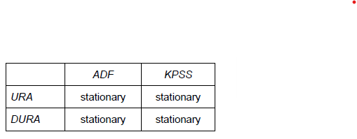

```{r setup, include = FALSE}

library(tidyverse)
library(readxl)
library(lubridate)
library(forecast)
library(knitr)

```

## Exercise 3


```{r e3, include = TRUE}

e3 <- read_excel("C:/Users/joshc/Documents/2023S2/ECON90033/Tutorials/Week 7/t7e3.xlsx", sheet = "URM")

ts_e3 <- function(x) {
  ts(x, start = c(1978,2), end = c(2023,1), frequency = 12)
}


```

### a) Plot URM and briefly describe the pattern of the data series


This tiem series has an additive seasonal component. Therefore, we should change the frequency from monthly to annual. Which has bene doing further below.

```{r e3a, include = TRUE}

e3a <- e3 %>% 
  select(-Time) %>% 
  map(~ts_e3(.x))


plot.ts(e3a[["URM"]], main = "Unemployment rate, monthly, percent, Australia", col = "red")


library(tsbox)

e3a <- e3 %>% 
  select(-Time) %>% 
  ts(URM, frequency = 12, start = c(1978,2), end = c(2023,1)) %>% 
  ts_frequency(to = "year", aggregate = "mean")


plot(e3a, main = "Unemployment rate, annual, per cent, Australia", col = "red")

```

## b) Perform the ADF and KPSS tests to determine the level of integration of the Australian unemployment rate

<br>

We are only concerned with the first test statisic, -3.575. Because its between the 5% and 1% critical values, we reject the unit root null hypothesis. Note that because the critical values decrease as significance tests get smaller, rejection is to the left of them.

This test only used one lag of the differenced uenmployment rate in the ADF test regression. Since the residuals seem random, one lag is sufficent.

We've also done the same test for the first difference of the unemployment rate. The test statistic is -5.32, well below the 1% critical value. Therefore, we can reject the unit root null hypothesis at the 1% level.

Again, there is only 1 lag of the differenced unemployment rate, and because the residuals look random this is fine.

<br>

```{r e3bi, include = TRUE}

library(urca)

e3b <- ur.df(e3a, type = "trend", selectlags = "BIC")

summary(e3b)
plot(e3b)

e3b_diff <- ur.df(diff(e3a), type = "drift", selectlags = "BIC")

summary(e3b_diff)
plot(e3b_diff)


```

<br>

Now we're going to same below the same process but using the KPSS test. Unlike the ADF test, rejection is to the right for the KPSS test.

This test statistics is 0.1181, which is below the 10% critical value. Therefore the null hypothesis is stationarity is maintained even at the 10% level.

However, the residuals do not seem random as they change sign relatively infrequently and seem to have positive first order autocorrelation. Therefore, we need to take the result of this test with caution.

Performing on the first difference we get the same result. Test statistic is 0.1394 and the 10% critical value is 0.347 - therefore we can maintain the null hypothesis even at the 10% level.

Looking at the residuals, there are 3 lags in the KPSS test regression, which seem to be sufficient even though SPACF has a significant spike at lag 2.


<br>

```{r e3bii, include = TRUE}


e3b_kpss <- ur.kpss(e3a, type = "mu", lags = "short")

summary(e3b_kpss)
plot(e3b_kpss)

e3b_kpss_diff <- ur.kpss(diff(e3a), type = "mu", lags = "short")

summary(e3b_kpss_diff)
plot(e3b_kpss_diff)

```

<br>

All things considered the ADF tests find sufficient evidence in the dat aagainst the unit root null hypothesis for the level and first difference, whereas the opposite is true for KPSS. These outcomes are best summarised in the table below.


```{r e3biii, include = TRUE, echo = FALSE}



```


## c) Split the sample data into two parts, training data from 1979 to 2018 and test data from 2019 to 2022. Use the auto.arima() function of R and the AICC specification criterion to find the best fitting ARMA model for the unemployment rate over the training period.

What we've done here is generate the best fitting ARMA model and some other model to compare performance. According to the performance metrics:

* ARMA(1,1) produced more accurate 'in-sample' forecasts for the unemployment rate.
* But ME, MAE, MAPE, MASE favour the ARMA(2,0) model.

This might seem weird given ARMA(1,1) was chosen by the algorithm. However, this was only chosen because it chose the smallest AICC value, without consideration of any other metric. Model specification criteria, like AICC, serve different purposs other than forecast accuracy measures and thus may rank specifications differently.

```{r e3ci}

e3c_train <- window(e3a, end = 2018)
e3c_test <- window(e3a, start = 2019)


plot(e3c_train, ylab = "URA", xlim = c(1978, 2023), ylim = c(3.5, 11),
col = "red", type = "l", main = "Training/Test Split")
lines(e3c_test, col = "blue", type = "l", lty = 2)
legend("topright", legend = c("Training", "Test"), col = c("red", "blue"), lty=1:2)

t <- ts(1:length(e3c_train), start = 1979, frequency = 1)

library(forecast)

e3c_best_train <- auto.arima(e3c_train, seasonal = FALSE, xreg = t, ic = "aicc", approximation = FALSE, stepwise = FALSE, trace = TRUE)

summary(e3c_best_train)

e3c_second <- Arima(e3c_train, order = c(2,0,0), xreg = t)
summary(e3c_second)

```

<br>

As always, it is always good practice to check the residuals of your models:

* For the "best" model the LB test shows residuals are serially uncorrelated. But based off the histogram and the SW test the residuals are not normally distributed.
* For the "second" model the LB test suggests the residuals are serially uncorrelated. Based on the histogram and SW test the residuals also appear to be normally distributed.

Therefore, the ARMA(2,0) model actually proved to be the more adequate.

<br>

```{r e3cii}

checkresiduals(e3c_best_train)
shapiro.test(e3c_best_train$residuals)


checkresiduals(e3c_second)
shapiro.test(e3c_second$residuals)

```


### d) Forecast the unemployment rate for the 2019-2023 test perido with both models. Which produces better "out of sample" forecasts.

The code below forecasts the unemployment rate using the two models.

The accuracy function generates a host of forecast error metrics. It's important you compare the model to the test data. These are the same metrics provided when generating the "summary" printout for each given model.

* According to ME, MAE, MAPE, MASE the ARMA(1,1) model produce the more accurate forecast.
* RMSE and MPE are in favour of the ARMA(2,0) model.

Therefore, we should expect ARMA(1,1) to generate more accurate ex ante forecasts.

Note that this is a different outcome to earlier, where we concluded that ARMA(2,0) produced better forecasts. This is because ARMA(2,0) produces better in-sample (ex-post) forecasts, but this exercise above shows ARMA(1,1) performs better out of sample.

```{r e3d}

t = ts(1:length(e3a), start = 1979, frequency = 1)

ar1ma1_ftest <- forecast(e3c_best_train, xreg = window(t, start = 2019))

ar2ma0_ftest <- forecast(e3c_second, xreg = window(t, start = 2019))

print(ar2ma0_ftest)
autoplot(ar2ma0_ftest)

print(ar1ma1_ftest)
autoplot(ar1ma1_ftest)

accuracy(ar1ma1_ftest, e3c_test)

accuracy(ar2ma0_ftest, e3c_test)


```

### e) Forecast the unemployment rate for 2023-2026 with the ARMA(1,1) model

In part (c) we used auto.arima() to copmare specifications over the training period. Now that we've concluded ARMA(1,1) is the best performing model, it is time to re-estimate it from all available observations before generating the ex ante forecasts.

Re-estimating gives us a slightly different output. This is good, because a good modle shouldn't change dramatically with the inclusion of a few new observations.

After estimating and forecasting we look at the residuals. The sample correlogram and LB test indicate the residuals are not autocorrelated and the histogram and the SW do not provide evidence against normality. Therefore, the stochastic errors might be serially uncorrelated and normally distributed.


```{r e3e}

ar1ma1 <- Arima(e3a, c(1,0,1), xreg = t)

summary(ar1ma1)

t <- ts(1:(length(e3a) + 4), start = 1979, frequency = 1)

ar1ma1_eaf = forecast(ar1ma1, xreg = window(t,start = 2023))

print(ar1ma1_eaf)

checkresiduals(ar1ma1)
shapiro.test(ar1ma1$residuals)

autoplot(ar1ma1_eaf)

```