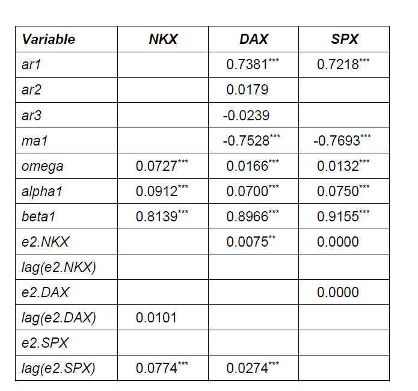

```{r setup, include = FALSE}

library(tidyverse)
library(readxl)
library(lubridate)
library(forecast)
library(knitr)
library(vars)
library(bruceR)
library(xts)
library(pastecs)

```

## Exercise 1

<br>

An important application of GARCH models examines how volatility is transmitted through different regions of the world during the course of a global financial trading day. Shocks to major markets can have delayed effects because they operate in different time zones.

You can model this spillover by splitting each day into three trading zones: Japan, Europe and the US.

We assume their conditions distributions are normal with a constant mean, but potentially time varying variances with independent contemporaneous shocks. Given the geographies of the trading zones are fixed:

* The conditional variance of Japan can be affected by the previous day's shocks to all three markets

* The conditional variance of the European markets can be affects by the same day shock to the Japanese market and yesterday's Euro/US shocks

* US conditional variance depends on same day US shocks and yesterday's Japanes/Euro market shocks.

In this framework there are two possible sources of volatility:

* **Heatwave** refers to volatility in any one region dueto the previous day's volatility in the same readion.

* **Meteor shower** refers to volatility in any one regions due to the same day's volatility in the region preceding it in terms of time. There is not meteror shower from Japan to Europe, nor is there from Japan to the US, nor is there from Europe to the US.

<br>

## Exercise 1

### a) Compute the percentage log returns on the DAX, NKX and SPX indices. Plot the three return series, calculate the usual descriptive statistics for each of them and briefly discuss the results regarding skewness, kurtosis and normality.

All three plots exhibit changing volatility with more or less coinciding periods of high and low volatility.

The reported skewness statistics are negative, implying they're all left skewed. However, DAX's value is insignificant at the 5% level.

All kurtosis statistics are above 3 and and kurt.2se value > 1, implying they all have fat-tail distributions relative to the normal distribution: they are leptokurtic. 

Therefore, its not surprising the SW tests have zero p-values (last row), so they reject normality at any reasonable significance level.

```{r e1a, include = TRUE}

e1 <- read_excel("C:/Users/joshc/Documents/2023S2/ECON90033/Tutorials/Week 9/t9e1.xlsx") 

Date <- e1 %>% 
  pull(Date)

# library(xts)

NKX <- e1 %>% 
  pull(NKX) %>% 
  xts(order.by = as.Date(Date)) 
  
NKX_r <- (log(NKX) - lag(log(NKX),1))*100

DAX <- e1 %>% 
  pull(DAX) %>% 
  xts(order.by = as.Date(Date)) 
  
DAX_r <- (log(DAX) - lag(log(DAX),1))*100

SPX <- e1 %>% 
  pull(SPX) %>% 
  xts(order.by = as.Date(Date)) 
  
SPX_r <- (log(SPX) - lag(log(SPX),1))*100

plot.xts(NKX_r, xlab = "Date", ylab = "%", main = "NXK percentage log returns", col = "darkgreen")
plot.xts(DAX_r, xlab = "Date", ylab = "%", main = "DAX percentage log returns", col = "red")
plot.xts(SPX_r, xlab = "Date", ylab = "%", main = "SPX percentage log returns", col = "darkblue")

options(scipen = 1000)
round(stat.desc(cbind(NKX_r, DAX_r, SPX_r), basic = FALSE, norm = TRUE), 4)

```

### b) Computer the deviations of returns from their respective sample mean, which are estimates of epsilon. Find the best fitting ARMA model for each error series using auto.arima.

This exercise tells us that:

* NXK errors are best modelled as white noise

* DAX errors are best modelled as ARMA(3,1)

* SPX errors are best modelled as ARMA(1,1)


```{r e1b, include = TRUE}

NKX_e = NKX_r - mean(NKX_r, na.rm = TRUE)
DAX_e = DAX_r - mean(DAX_r, na.rm = TRUE)
SPX_e = SPX_r - mean(SPX_r, na.rm = TRUE)

auto.arima(NKX_e)

auto.arima(DAX_e)

auto.arima(SPX_e)


```


### c) the NKX, DAX and SPX indices are from teh Japanese, Europrean and US markets respectively. Given the discussion about about heatwaves, meteor showers and the suggest mean equations from part (b), estiamte the given GARCH(1,1) model for NKX.

```{r e1c, include = TRUE}

#Calculate squared deviations 

NKX_e2 <- NKX_e^2
DAX_e2 <- DAX_e^2
SPX_e2 <- SPX_e^2

library(rugarch)

options(scipen = 0)

n = length(NKX)

spec_NKX <- ugarchspec(mean.model = list(armaOrder = c(0,0), include.mean = FALSE),
                       variance.model = list(model = "sGARCH",
                                             garchOrder = c(1,1),
                                             external.regressors = cbind(lag(DAX_e2)[3:n,1],
                                                                         lag(SPX_e2)[3:n,1])),
                       distribution.model = "norm")

fit_NKX <- ugarchfit(spec = spec_NKX, data = NKX_e[3:n,1])
fit_NKX

```

### d) Based on the suggested mean equation in part (b), estimate a GARCH(1,1) model for the DAX index.

```{r e1d, include = TRUE}

spec_DAX <- ugarchspec(mean.model = list(armaOrder = c(3,1),
                                         include.mean = FALSE),
                       variance.model = list(model = "sGARCH",
                                             garchOrder = c(1,1),
                                             external.regressors = cbind(NKX_e2[3:n,1],
                                                                         lag(SPX_e2)[3:n,1])),
                       distribution.model = "norm")

fit_DAX = ugarchfit(spec = spec_DAX, data = DAX_e[3:n,1])
fit_DAX

```

### e) Based on the suggested mean equation in part (b), estimate a GARCH(1,1) model for the SPX index.

```{r e1e, include = TRUE}

spec_SPX <- ugarchspec(mean.model = list(armaOrder = c(1,1),
                                         include.mean = FALSE),
                       
                       variance.model = list(model = "sGARCH",
                                             garchOrder = c(1,1),
                                             external.regressors = cbind(NKX_e2[3:n,1],
                                                                         DAX_e2[3:n,1])),
                      
                       distribution.model = "norm")

fit_SPX <- ugarchfit(spec = spec_SPX, data = SPX_e[3:n,1])
fit_SPX

```

### f) summarise the parameter estimates and thier significance in a table and briefly discuss them in terms of heatwaves and meteor showers in volatility patterns between Japan, Europe and the US.

<br>

The table below shows the results from these three models (*: 10%, **:5%, ***:1%), which tells us:

* beta1, the coefficient of the lagged conditional variance is significant in each model. This mena that volatility in every region is partly determined by previous trading day's volatility in the same region, supporting the heatwave (alternative) hypothesis.

* There is also some evidence of the meteor shower effects since shocks to the Japanese market seem to influence the European market on the same trading day. However, there is a meteor shower neither to the US, nor from Europe to the US.

These conclusions indicate volatility of the global markets are combinations of heatwaves adn meteor showers.


```{r e1f, include = TRUE}



```